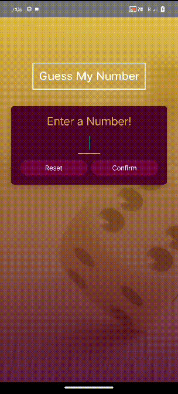

# Guess Number Game

  

## Description

This React Native application implements a Guess Number game. The game involves entering a number, guessing the correct number within a range, and provides a user interface for confirming or resetting guesses.

## Technologies Used

- React Native
- Core Components
- Complex Layout and Styles
- Reusable Components and Styles
- Cross-Platform User Interface

## Screens

### Enter Number Screen

- The player can enter a number.
- Two buttons: "Confirm" and "Reset."
  - "Confirm" redirects to the game screen.
  - "Reset" clears the input field.

### Game Screen

- The system generates a random number between 0 and 100.
- Two buttons: "+" and "-" to indicate whether the guess is higher or lower.
- Displays the current guess in a flat list.
- When the correct number is guessed, it redirects to the Game Over screen.

### Game Over Screen

- Shows a game over image.
- Displays details including the number of guesses and the correct number.
- A button to start the game again, redirecting to the Enter Number screen.

### Start Game Screen

- A button to start the game, redirecting to the Enter Number screen.

## Getting Started

### Prerequisites

- Node.js installed on your computer.

### Installation

1. **Clone the repository to your local machine**
2. **Navigate to the project directory**
3. **Install dependencies**
4. **Start the app**
5. **Follow the instructions in the terminal to run the app on your desired platform (iOS/Android).**

## Usage

- **Enter Number Screen:**
  - Input your guess.
  - Click "Confirm" to start the game or "Reset" to clear the input.

- **Game Screen:**
  - Guess whether the hidden number is higher or lower.
  - View your guesses in the list.

- **Game Over Screen:**
  - See the game outcome with details.
  - Click "Play Again" to start a new game.

- **Start Game Screen:**
  - Click the button to start a new game from the beginning.

## Contributions

Contributions to the project are welcome! If you'd like to contribute, please follow these steps:

1. Fork the repository.
2. Create a new branch for your feature.
3. Implement your changes.
4. Open a pull request detailing your changes.

## Contact

For any inquiries or support, please contact [ishikanimade56@gmail.com](mailto:ishikanimade56@gmail.com).

Feel free to customize the sections and content as per your specific application requirements and reach out to us with any questions, feedback, or suggestions you may have.

